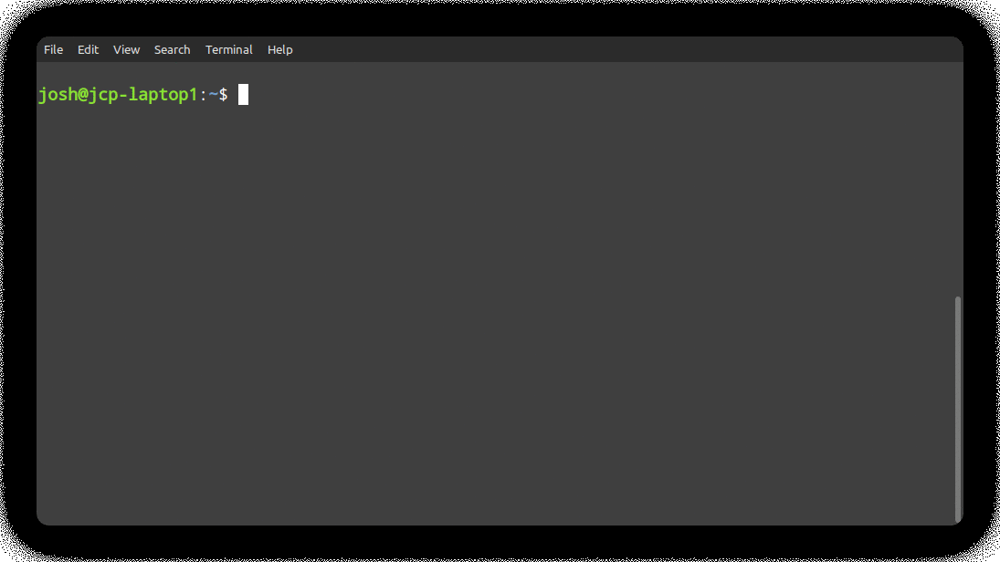

---

[](https://github.com/magneticstain/ip-2-cloudresource/actions/workflows/build_main.yml)
[](https://github.com/magneticstain/ip-2-cloudresource/actions/workflows/build_release.yml)
[](https://github.com/magneticstain/ip-2-cloudresource/actions/workflows/release.yml)

[](https://app.codacy.com/gh/magneticstain/ip-2-cloudresource/dashboard?utm_source=gh&utm_medium=referral&utm_content=&utm_campaign=Badge_grade)
[](https://app.codacy.com/gh/magneticstain/ip-2-cloudresource/dashboard?utm_source=gh&utm_medium=referral&utm_content=&utm_campaign=Badge_coverage)


## Summary

IP-2-CloudResource (IP2CR) is a tool used for correlating a cloud IP address with its associated resources. It focuses on providing as much context to the user as possible, as fast as possible.



## Features

- Built for speed and ease-of-use while only generating a small resource footprint
- Supports finding IPs for:
  - CloudFront
  - ALBs & NLBs (and probably GLBs, but hasn't been tested yet)
  - Classic ELBs
  - EC2 instances with public IP addresses
- Support for searching through accounts within an AWS Organization
- IPv6 support
- JSON output to easily integrate with scripts
- Ability to map the network path taken from the internet to the identified resource

### Roadmap

#### 2023

- [X] EC2 support ( [Issue #11](https://github.com/magneticstain/ip-2-cloudresource/issues/11) )
- [X] Classic ELB support ( [Issue #29](https://github.com/magneticstain/ip-2-cloudresource/issues/29) )
- [X] JSON output ( [Issue #37](https://github.com/magneticstain/ip-2-cloudresource/issues/37) )
- [X] IP service fuzzing (perform a reverse DNS lookup to identify the services to search, leading to faster results)  ( [Issue #39](https://github.com/magneticstain/ip-2-cloudresource/issues/39) )
- [X] Support for installing using Homebrew ( [Issue #77](https://github.com/magneticstain/ip-2-cloudresource/issues/77) )
- [X] AWS Organizations support ( [Issue #38](https://github.com/magneticstain/ip-2-cloudresource/issues/38) )
- [X] Add Support For Concurrent Account-Based Resource Searches When Running With AWS Org Support ( [Issue #141](https://github.com/magneticstain/ip-2-cloudresource/issues/141) )
- [X] Network path calculation ( [Issue #44](https://github.com/magneticstain/ip-2-cloudresource/issues/44) )

#### 2024

- [X] Docker Support ( [Issue #367](https://github.com/magneticstain/ip-2-cloudresource/issues/367) )
- [X] GCP Support ( [Issue #361](https://github.com/magneticstain/ip-2-cloudresource/issues/361) )
- [ ] Azure Support ( [Issue #362](https://github.com/magneticstain/ip-2-cloudresource/issues/362) )

## Prerequisites

### OS

- Linux
- MacOS
- Windows

### Go

IP2CR supports running on n-1 minor versions of Golang, aka [stable and old-stable](https://go.dev/dl/#stable).

## Install

### Docker

The most portable way to install and run IP2CR is by using Docker.

#### Via Container Registry

The easiest way to run IP2CR in Docker is by using the public containers hosted on container registries. IP2CR images are available on both Docker Hub and GitHub Container Registry. See the commands below for how to run IP2CR using each registry.

##### Docker Hub

```bash
docker run --rm --name=ip-2-cloudresource magneticstain/ip-2-cloudresource
```

##### Github Container Registry

```bash
docker run --rm --name=ip-2-cloudresource ghcr.io/magneticstain/ip-2-cloudresource
```

#### Via Local Build

In the case that container registries are unavailable, there's also the option to build the image locally. To do that, check out the `main` branch of this repo, build the IP2CR image, and run it.

```bash
git clone https://github.com/magneticstain/ip-2-cloudresource.git
docker build -t ip-2-cloudresource .
docker run --rm --name=ip-2-cloudresource ip-2-cloudresource
```

### Homebrew

The easiest way to install IP2CR if you're using Mac OS is to use [Homebrew](https://brew.sh). With homebrew installed, run the following to install IP2CR:

```bash
brew tap magneticstain/ip2cr
brew install ip2cr
```

Once the install completes, you should be able to run the `ip2cr` command from your path.

### Go Install

If homebrew isn't an option, you can also install using `go install`:

```bash
go install github.com/magneticstain/ip-2-cloudresource@latest
```

### Binary

Finally, if all else fails or you prefer directly managing IP2CR, to install the IP2CR binary, download the version that matches your OS from the latest release in the release page. The link for that page can be found to the right of this page.

After downloading, extract to your preferred app directory. E.g.:

```bash
mkdir -p /opt/ip2cr
tar -xvzf ip2cr_Linux_x86_64_v0.0.3.tar.gz -C /opt/ip2cr/
cd /opt/ip2cr/
```

## Usage

After installing, run the `ip2cr` binary to see available parameters:

```bash
> ip2cr --help
Usage of ip2cr:
  -adv-ip-fuzzing
    	Toggle the advanced IP fuzzing feature to perform a more intensive heuristics evaluation to fuzz the service (not recommended for IPv6 addresses) (default true)
  -ip-fuzzing
    	Toggle the IP fuzzing feature to evaluate the IP and help optimize search (not recommended for small accounts) (default true)
  -ipaddr string
    	IP address to search for (default "127.0.0.1")
  -json
    	Outputs results in JSON format; implies usage of --silent flag
  -network-mapping
    	If enabled, generate a network map associated with the identified resource, if found (default: false)
  -org-search
    	Search through all child accounts of the organization for resources, as well as target account (target account should be parent account)
  -org-search-ou-id string
    	The ID of the AWS Organizations Organizational Unit to target when performing a search
  -org-search-role-name string
    	The name of the role in each child account of an AWS Organization to assume when performing a search (default "ip2cr")
  -org-search-xaccount-role-arn string
    	The ARN of the role to assume for gathering AWS Organizations information for search, e.g. the role to assume with R/O access to your AWS Organizations account
  -platform string
    	Platform to target for IP search (e.g. aws, gcp, etc) (default "aws")
  -project-id string
    	For cloud platforms that require it (e.g. GCP), set this to the ID of the target project to search
  -silent
    	If enabled, only output the results
  -svc string
    	Specific cloud service(s) to search. Multiple services can be listed in CSV format, e.g. elbv1,elbv2. Available services are: cloudfront , ec2 , elbv1 , elbv2 (default "all")
  -verbose
    	Outputs all logs, from debug level to critical
```

### Using IP2CR With MFA Role

A large number of enterprises configure their IAM architecture such that users login to a central AWS account and then assume various IAM roles in other accounts as needed. It's [recommended by AWS](https://docs.aws.amazon.com/IAM/latest/UserGuide/id_credentials_mfa_configure-api-require.html) that these roles are configured to require the principal to be authenticated using MFA. This can present a problem when configuring AWS credentials using a profile that assumes a target role using MFA (denoted by the usage of the `mfa_serial` as part of the profile) as the AWS SDK does not support (automatically) prompting the user for MFA input.

Instead, this will present itself as a fatal error within IP2CR, e.g.:

```text
INFO[0000] starting IP-2-CloudResource                  
DEBU[0000] generating AWS connection                    
FATA[0000] assume role with MFA enabled, but AssumeRoleTokenProvider session option not set.
```

#### Workaround

To get around this, you will need to generate the STS credentials outside of IP2CR and set them as stated in AWS's documentation. There are several options for this; the two most common are included below:

1. Use the AWS CLI to [generate STS credentials for the role](https://docs.aws.amazon.com/IAM/latest/UserGuide/id_credentials_temp_use-resources.html#using-temp-creds-sdk-cli)
2. Use [awsume](https://awsu.me/) or a similar tool to easily handle AWS credentials

Once you have used your preferred method to generate and set STS credentials, rerun IP2CR and it should work as expected.

### Use Case Recommendations & Parameter Guide

#### Basic Usage

```bash
ip2cr -ipaddr=1.2.3.4
```

#### Single AWS Account or AWS Organizations Search?

If you're searching a single account with a small - medium amount of IP addresses, it's recommended to disable IP fuzzing as the overhead results in a longer search time than simply searching through all IPs.

```bash
ip2cr -ipaddr=1.2.3.4 -ip-fuzzing=false -adv-ip-fuzzing=false
```

If you're performing a search across multiple accounts in your AWS Organization, you can enable the feature by adding the `-org-search` flag:

```bash
ip2cr -ipaddr=1.2.3.4 -org-search
```

If using a cross-account role name other than the default, ensure that is specified as well:

```bash
ip2cr -ipaddr=1.2.3.4 -org-search -org-search-role-name=ip2cr-xaccount-role
```

If you need to assume a target role to read AWS Organizations metadata, you can add another parameter with the target role ARN:

```bash
ip2cr -ipaddr=1.2.3.4 -org-search -org-search-role-name=ip2cr-xaccount-role -org-search-role-name=arn:aws:iam::123456789012:role/org-manage
```

If you know which AWS Organizations OU contains the account the target IP is in, you can specify it by adding the `-org-search-ou-id` parameter:

```bash
ip2cr -ipaddr=1.2.3.4 -org-search -org-search-role-name=ip2cr-xaccount-role -org-search-role-name=arn:aws:iam::123456789012:role/org-manage -org-search-ou-id=ou-abcd-12345
```

For more information on this feature, see the [AWS Organizations Support Guide](https://github.com/magneticstain/ip-2-cloudresource/wiki/AWS-Organizations-Support-Guide).

#### IPv4 or IPv6 Address?

If searching for an IPv6 address, you should disable advanced IP fuzzing. It uses reverse DNS lookups to perform hostname analysis, which [doesn't really work the same in IPv6 land as it does with IPv4 addresses](https://en.wikipedia.org/wiki/Reverse_DNS_lookup#IPv6_reverse_resolution):

```bash
ip2cr -ipaddr=2001:0db8:85a3:0000:0000:8a2e:0370:7334 -adv-ip-fuzzing=false
```

#### Programmatic Usage?

For programmatic usage of IP2Cr, you may benefit from using the `-json` flag to toggle JSON-formatted output:

```bash
ip2cr -ipaddr=1.2.3.4 -json
```

#### Speed Run

If you're looking to run IP2CR as fast as possible (single account), disable IP fuzzing (both basic and advanced) and specify the cloud service for IP2CR to search:

```bash
ip2cr -ipaddr=1.2.3.4 -ip-fuzzing=false -adv-ip-fuzzing=false -svc=ec2
```

## Testing/Demo

You can use the Terraform plans provided here to generate sample resources in AWS for testing.

<https://github.com/magneticstain/tf-ip2cr>

## Support, Feature Requests, and General Community Discussion

The `Discussions` module of this repository has been setup as a place to get support, discuss new features, and facilitate any general discorse related to IP2CR.

If you are having an issue when using IP2CR, or just need general help, you should start here as opposed to creating an Issue. Any Issues created for support purposes will be closed.
